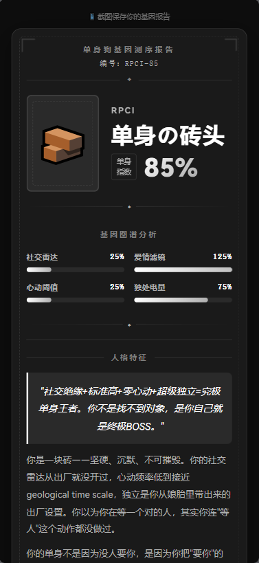

# 🧬 互动人格测试生成器

[](https://www.codebuddy.cn/) [](https://pages.edgeone.ai/) [](LICENSE)

> 用 AI Prompt 驱动，生成任意主题的互动人格测试网站。

---

<table border="1" cellpadding="16" cellspacing="0" style="border-collapse: collapse; border-color: #ddd; border-radius: 8px;">
<tr>
<td>

⭐ 我是一名平面设计师，日常工作在 PS 和 AI 里完成（Adobe 家的），不会写代码。

之前看到有人做的 SBTI 出圈爆火，觉得很有意思。但大多数人没能力自己做一个——我也一样。

所以想做一个东西，让每个人都能创建自己感兴趣的测试题，跟朋友分享。

设计上没有追求特别高级的视觉风格，而是选择了不容易出错的方案——**很多时候，一个 emoji 就能表达一切！！！**

**希望大家都能享受创建的过程，从中得到乐趣。**

从想法到上线，整个过程都在 WorkBuddy 里完成。感谢 WorkBuddy。

</td>
</tr>
</table>

---

## 📱 Demo

**主题：单身狗基因测序**

> 将单身状态比喻为"基因序列"——每个人的单身原因不是随机的，而是由多个心理维度组合而成的稳定模式。36 种基因序列，解密你的单身密码。

👉 [在线体验](https://prompt-demo-de7mccev.edgeone.cool)

<table>
  <tr>
    <td></td>
    <td></td>
  </tr>
  <tr>
    <td></td>
    <td></td>
  </tr>
</table>

## 🧠 Prompt 设计

本项目由一个 AI Prompt 生成。Prompt 的核心设计理念：

1. **约束 > 自由** — UI 固定不可改（调了很久的视觉不想翻车），内容完全自定义
2. **示例胜过规则** — 36 种人格命名、emoji、文案都有质量标准和反例
3. **理论映射流程** — 理论 → 维度 → 题目，每一步都有据可查
4. **兼容性底线** — 微信浏览器可用、3G 可加载、不用太新的 JS 语法

## 🎯 这是什么

你只需要告诉 AI 一个主题（比如"单身狗基因测序""吃货鉴定""程序员段位"），它会自动生成：

- 理论支撑的题库（非瞎编）
- 多维度人格分析系统
- 精美的极简黑白风 UI
- 雷达图 + 结果页 + 分享卡片
- 一键部署到 EdgeOne Pages

## ✨ 核心亮点

### 🔬 理论支撑，不是瞎编

每个维度都有心理学/行为学理论依据：

| 维度 | 理论来源 |
|------|----------|
| 社交倾向 | 依恋理论（Bowlby, 1969） |
| 择偶标准 | 爱情三角理论（Sternberg, 1986） |
| 心动模式 | 情绪调节理论（Gross, 1998） |
| 独处能力 | 孤独感理论（Perlman & Peplau, 1981） |

### 🧩 弹性维度系统

- 固定 4 维度，每维 2-3 档
- 自动计算组合数（16-36 种人格）
- 结果码像 MBTI 一样有辨识度（如 `APSI`）

### 📊 质量评分卡

结果页显示理论覆盖率、参考文献数，从"娱乐测试"升级到"有据可查"。

### 🎨 视觉设计

- 极简黑白风格
- DNA 主题（双螺旋加载、链式进度条）
- 暗色结果页 + 证书风格
- 四维度雷达图
- 分享卡片自动生成

## 🛠 技术栈

| 技术 | 说明 |
|------|------|
| Vue 3 | CDN 引入，无构建步骤 |
| 纯静态 HTML/CSS/JS | 零依赖，单页应用 |
| EdgeOne Pages | 腾讯云边缘部署，全球加速 |
| WorkBuddy | AI 驱动开发，从 Prompt 到上线 |

## 📁 项目结构

```
prompt-demo/
├── index.html          # Vue 3 单页应用（首页→答题→加载→结果）
└── js/
    └── data.js         # 题库 + 人格数据 + 计分逻辑
```

## 📚 参考文献

- Bowlby, J. (1969). *Attachment and Loss: Vol. 1. Attachment*
- Sternberg, R. J. (1986). *A Triangular Theory of Love*
- Gross, J. J. (1998). *The Emerging Field of Emotion Regulation*
- Perlman, D., & Peplau, L. A. (1981). *Toward a Social Psychology of Loneliness*
- McCrae, R. R., & Costa, P. T. (1987). *Validation of the Five-Factor Model*
- Deci, E. L., & Ryan, R. M. (2000). *Self-Determination Theory*

## 📄 License

MIT

---

*Built with [WorkBuddy](https://www.codebuddy.cn/) & [EdgeOne Pages](https://pages.edgeone.ai/) · Prompt Engineering Competition 2026*
